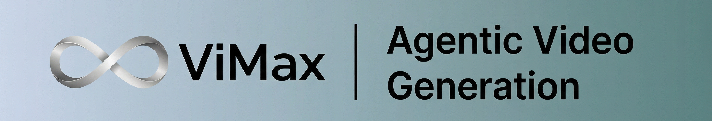
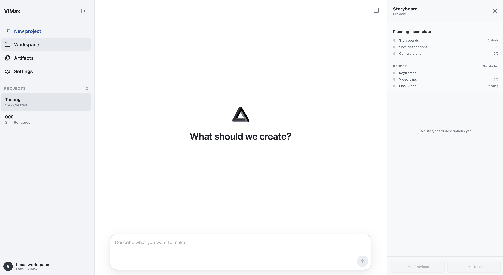

<div align="center">
   
  <br>
  <br>
  <h1 align="center">ViMax: Agentic Video Generation</h1>
  <p align="center">
    <a href="https://trendshift.io/repositories/15299" target="_blank" rel="noopener noreferrer"></a>
    <a href="https://trendshift.io/repositories/15299?utm_source=trendshift-badge&amp;utm_medium=badge&amp;utm_campaign=badge-trendshift-15299" target="_blank" rel="noopener noreferrer"></a>
  </p>

  <div align="center">
  </div>

  <p align="center">
    
	<a href="https://github.com/astral-sh/uv"></a>
	
    <a href="https://github.com/HKUDS/ViMax/releases/tag/v1.2.0"></a>
    <a href='https://www.youtube.com/@AI-Creator-is-here'></a>
    <a href='https://arxiv.org/abs/2606.07649'></a>
  </p>

  <p align="center">
    <a href="./Communication.md"></a>
    <a href="./Communication.md"></a>
	<a href="readme.md"></a>
    <a href="README_ZH.md"></a>
    <a href="#quick-start"></a>
  </p>

</div>

---

<div align="center">


https://github.com/user-attachments/assets/5bad46b2-8276-4e1d-9480-3522640744b2


</div>

---

### 📰 **动态**

- **2026-07-20** 🚀 **ViMax v1.2.0** 发布 Web UI，支持命名项目、Agent Loop 对话、产物与分镜预览、渲染检查点、文件上传、供应商设置和深色模式。
- **2026-07-17** 🎬 新增 OpenRouter GPT Image 2 图像生成与 Seedance 2.0 Fast 视频生成支持。

---


## 📑 目录

- [✨ 核心特性](#核心特性)
- [🔮 演示示例](#演示示例)
- [🚀 快速开始](#quick-start)

---
## ✨ 核心特性

ViMax 是一个智能体驱动的视频创作框架，在统一且可扩展的工作流中串联叙事规划、视觉一致性、图像生成、视频生成与成片组装。

- **Idea2Video** — 将简短创意扩展为结构化故事、角色、剧本、分镜、镜头设计与最终视频。
- **Script2Video** — 将明确剧本转化为可控的多场景、多镜头视频，同时保留原有创作意图。
- **Novel2Video** — 通过叙事压缩、角色追踪与场景规划，将长篇小说改编为分集视觉内容。
- **AutoCameo** — 根据参考照片将人物或宠物融入生成故事，并保持外观一致性。
- **Agent Loop 与 TUI** — 在统一交互工作区中讨论创意、修改规划、恢复 session、检查文本产物并控制渲染。
- **Web UI** — 在浏览器中管理命名项目、与 ViMax Agent 协作、上传源文件、查看产物和分镜进度、预览渲染并配置供应商。
- **一致性制作流程** — 端到端协调参考图、首帧、机位连续性与最终组装。
- **并行加速生成** — 并发生成可并行处理的镜头与媒体资产，缩短多镜头视频制作时间。

---
<table>
<tr>

<td align="center" width="33%">
  <video src="https://github.com/user-attachments/assets/c2fb27b0-218c-4976-b3d6-2abf8ea06be7" controls width="100%"></video>
</td>
<td align="center" width="33%">
  <video src="https://github.com/user-attachments/assets/bfa566a8-688d-4d53-a9e2-6cedeb4a399d" controls width="100%"></video>
</td>
<td align="center" width="33%">
  <video src="https://github.com/user-attachments/assets/49f61134-4f78-4285-9a9e-bb5e3e0c4abf" controls width="100%"></video>
</td>
</tr>
<tr>
<td align="center" width="33%">
  <video src="https://github.com/user-attachments/assets/a950f449-a15c-449b-a1b8-c393951aa9be" controls width="100%"></video>
</td>
<td align="center" width="33%">
  <video src="https://github.com/user-attachments/assets/bb3ff0fd-9433-4806-886a-3f77b61d06ec" controls width="100%"></video>
</td>
<td align="center" width="33%">
  <video src="https://github.com/user-attachments/assets/2624a3f0-9f66-4fa4-b527-45c0ea0353fc" controls width="100%"></video>
</td>
</tr>

<tr>
<td align="center" width="33%">
  <video src="https://github.com/user-attachments/assets/5dbb80f7-aff0-4211-940c-a898f91fb80c" controls width="100%"></video>
</td>
<td align="center" width="33%">
  <video src="https://github.com/user-attachments/assets/cc0b0bcd-e7db-4839-950b-0b03949637bd" controls width="100%"></video>
</td>
<td align="center" width="33%">
  <video src="https://github.com/user-attachments/assets/85919b59-80f0-461a-af7e-a93d3fb412fc" controls width="100%"></video>
</td>
</tr>


</table>


---

### 🖥️ **ViMax Web UI**

<div align="center">
  
</div>

Web UI 将 Agent 对话、项目产物、分镜预览与渲染进度集中在同一个可视化工作区中。

---

### 🎯 **端到端视频创作引擎**

**面临的挑战**：

- 🌅 **参考图像**：获取、整理并精准对齐能准确表达角色、物体、位置与环境的参考帧，耗时费力。

- 🫠 **一致性校验**：即使提供了正确的角色、位置、环境参考图与提示词，图像生成器有时仍会产出不可用图像。

- 📄 **剧本生成**：专业高质量视频需要高信息密度与结构化设计。

- 📝 **分镜设计**：将故事转化为视觉叙事，需要摄影、构图与视觉叙事的专业知识，而大多数创作者并不具备。

- 🎬 **镜头设计**：在复杂场景中保持叙事连贯性的同时，设计合理的镜头角度、转场与节奏。

- 🎨 **风格一致性**：在长视频中确保数百个镜头的角色外观、环境与艺术风格保持一致。

- ⏱️ **制作效率**：传统视频制作依赖多个专业人员与冗长流程，阻碍了独立创作者与快速原型开发。

- 🎥 **AI视频扩展性**：AI生成视频通常仅几秒，而分钟级甚至小时级的高质量长视频需要复杂的跨场景连续性与多分镜协同处理能力。

**ViMAX**：通过自动化从叙事输入到最终视频输出的完整流程，彻底消除上述制作瓶颈。

---


### 🔥 **为什么选择 ViMax？**

| 🧠 **一键生成** | 🚀 **完全创作自由** | 🔊 **音画同步** | 🎨 **专业品质** | 🤩 **互动视频** 
|:---:|:---:|:---:|:---:|:---:|
| 一句话生成完整视频 | 任何叙事皆可成真 | 音画完美融合 | 电影级输出 | 生成你的专属客串视频
| 无需技术细节——只需描述你的创意，ViMax 自动完成剧本生成、分镜设计、镜头规划、参考管理与一致性验证 | 创意无边界——无论是预告片、短篇故事、小说章节还是原创概念，ViMax 都能智能构建叙事并设计镜头语言，将任何想法变为现实 | 无缝融合角色语音与音效，打造沉浸式视听体验 | 自动质量控制确保角色一致性、场景构图合理、每帧画面均达专业水准 | 上传你的照片即可在自己的故事中互动出演——ViMax 智能将你作为角色融入视频，保持外观一致并实现自然交互


---

### ☄️ **路线图**

- ✅ 🖥️ **支持产物、分镜与渲染预览的 Web 前端工作区**
- ✅ 🤖 **Agent Loop + TUI 交互式工作流**
- ✅ 🎬 **Seedance 2.0 Fast 视频生成支持**
- ✅ 🖼️ **GPT Image 2 图像生成支持**

---


## 🚀Quick Start

### 🖥️ **Environment**

```
OS: Linux, Windows
```

### 📥 **Clone and Install**
We use uv to manage the environment. For uv installation, please refer to the https://docs.astral.sh/uv/getting-started/installation/.
```bash
git clone https://github.com/HKUDS/ViMax.git
cd ViMax
uv sync
```


<details>
<summary><strong>Agent TUI / Agents Loop</strong></summary>

ViMax 还提供用于交互式 Agent 视频创作的最小 TUI。先从受 Git 跟踪的示例创建私有本地配置：

```bash
cp configs/agent.example.yaml configs/agent.local.yaml
```

随后在 `configs/agent.local.yaml` 中配置 LLM、图像和视频供应商，并从 ViMax 根目录启动 TUI。
```bash
vimax tui
```

Start a new session or resume an existing one:
```bash
vimax tui new
vimax tui resume
vimax tui resume <session_id>
```

</details>

<details>
<summary><strong>Web UI</strong></summary>

Web UI 与 TUI 共用同一套 ViMax agent runtime、session、tools 和私有的 `configs/agent.local.yaml` 配置。运行 Web UI 需要 Node.js 18 或更高版本。

在 `ViMax` 仓库根目录中，首次使用时安装前端依赖，然后启动本地服务：

```bash
cd web
npm install
npm run dev
```

在浏览器中打开 [http://127.0.0.1:4173](http://127.0.0.1:4173)。Web UI 支持命名项目、Agent 对话、斜杠命令、产物与渲染查看、分镜预览、文件上传和供应商设置。

服务默认只监听 `127.0.0.1`。如果 ViMax 运行在远程服务器上，请在本地电脑建立 SSH 端口转发：

```bash
ssh -N -L 4173:127.0.0.1:4173 <user>@<server>
```

需要改用其他端口时，设置 `VIMAX_WEB_PORT`：

```bash
VIMAX_WEB_PORT=4174 npm run dev
```

</details>

<details>
<summary><strong>Usage</strong></summary>

main_idea2video.py is used to convert your ideas into videos.
You need to configure the model and API key information in the configs/idea2video.yaml file, including three parts—the chat model, the image generator, and the video generator, as shown below
```yaml
chat_model:
  init_args:
    model: google/gemini-2.5-flash-lite-preview-09-2025
    model_provider: openai
    api_key: <YOUR_API_KEY>
    base_url: https://openrouter.ai/api/v1

image_generator:
  class_path: tools.ImageGeneratorNanobananaGoogleAPI
  init_args:
    api_key: <YOUR_API_KEY>

video_generator:
  class_path: tools.VideoGeneratorVeoGoogleAPI
  init_args:
    api_key: <YOUR_API_KEY>

working_dir: .working_dir/idea2video
```

Then, provide a simple yet thoughtful idea and the corresponding creative requirements in main_idea2video.py.
```bash
idea = \
"""
If a cat and a dog are best friends, what would happen when they meet a new cat?
"""
user_requirement = \
"""
For children, do not exceed 3 scenes.
"""
style = "Cartoon"
```

main_script2video.py generates a video based on a specific script.
You similarly need to set up the API configuration in configs/script2video.yaml file. Then, provide a scene script and the corresponding creative requirements in main_script2video.py, as shown below.
```python
script = \
"""
EXT. SCHOOL GYM - DAY
A group of students are practicing basketball in the gym. The gym is large and open, with a basketball hoop at one end and a large crowd of spectators at the other end. John (18, male, tall, athletic) is the star player, and he is practicing his dribble and shot. Jane (17, female, short, athletic) is the assistant coach, and she is helping John with his practice. The other students are watching the practice and cheering for John.
John: (dribbling the ball) I'm going to score a basket!
Jane: (smiling) Good job, John!
John: (shooting the ball) Yes!
...
"""
user_requirement = \
"""
Fast-paced with no more than 20 shots.
"""
style = "Animate Style"
```

</details>

---
