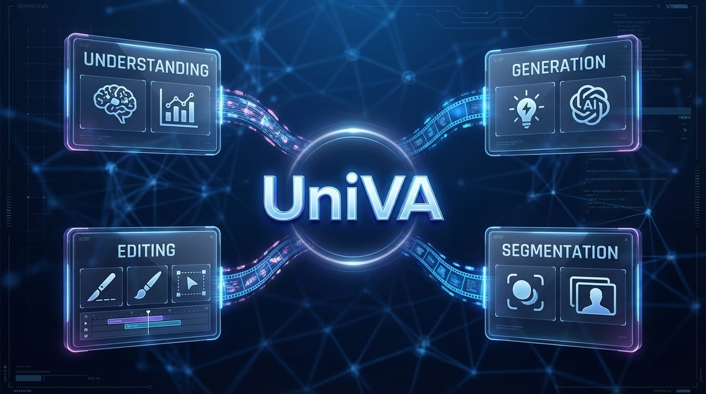

# UniVA: Universal Video Agent
# **Towards Open-Source Next-Generation Video Generalist**

<p align="center">
    <a href="https://univa.online" target="_blank">
        
    </a>
    <a href="https://ngrok-univa.chrisprox599.workers.dev/" target="_blank">
        
    </a>
    <a href="https://arxiv.org/abs/2511.08521" target="_blank">
        
    </a>
    <a href="https://huggingface.co/datasets/UniVA-Agent/UniVA-Bench" target="_blank">
        
    </a>
    <a href="https://huggingface.co/spaces/UniVA-Agent/UniVA-Leaderboard" target="_blank">
        
    </a>
    <a href="https://discord.gg/85GkGW897V" target="_blank">
        
    </a>
</p>

<p align="center">
 
</p>


## 🎯 Overview

**UniVA** (Universal Video Agent) is an open-source, next-generation video generalist system that enables you to **plan, compose, and produce** videos through natural language instructions. UniVA acts as your intelligent video director, iterating shots and stories with you through an agentic, proactive workflow.

### ✨ Key Features

#### 🎬 Agentic Creation
- **Multi-round co-creation**: Talk like a director; UniVA iterates shots & stories with you
- **Deep memory & context**: Global + user memory keep preferences, lore, and styles consistent
- **Implicit intent reading**: Understands vague & evolving instructions; less prompt hacking
- **Proactive agent**: Auto plans, checks, and suggests better shots & stories, not just obeys
- **End-to-end workspace**: UniVA plans, calls tools, and delivers full videos

#### 🎥 Omnipotent Video Production Engine
- **Universal video fabric**: Text / Image / Entity / Video → controllable video in one framework
- **Any-conditioned pipeline**: Supports super HD & consistent, cinematic quality with stable identity & objects
- **Complex narratives**: Multi-scene, multi-role, multi-shot stories under structured control
- **Ultra-long & fine-grained editing**: From long-form cuts to per-shot/per-object refinement
- **Grounded by understanding**: Long-video comprehension & segmentation guide generation & edits

#### 🔧 Extensibility
- **MCP-native**: Modular design, easy to extend with new models & tools
- **Industrial quality**: Production-ready video generation capabilities

---

## 🏗️ Architecture

UniVA consists of two main components:

### Backend (Python)
- **Plan Agent**: High-level planning and task decomposition
- **Act Agent**: Execution of specific video generation tasks
- **MCP Tools**: Modular tools for video processing, generation, and editing
- **FastAPI Server**: RESTful API for client communication

### Frontend (Next.js)
- **Web Interface**: User-friendly chat interface
- **Video Editor**: Timeline-based video editing capabilities
- **Project Management**: Save and manage video projects
- **Authentication**: User management and access control

---

## 🚀 Installation

### Prerequisites

- **Python**: 3.10 or higher
- **Node.js**: 18.0 or higher (only if using the web frontend)
- **Bun**: 1.2.18 or higher (only if using the web frontend)
- **CUDA**: Recommended for GPU acceleration (optional but recommended)

### Backend Installation

The backend is the core UniVA agent system. You can use it standalone without the frontend.

#### 1. Clone the Repository

```bash
git clone https://github.com/univa-agent/univa
cd univa
```

#### 2. Install Python Dependencies

```bash
pip install -r requirements_simple.txt
```

And using the project configuration:

```bash
pip install -e .
```

#### 3. Configure Environment & Models

Copy the example configuration file to create your local environment configuration:

```bash
cp .env.example .env
```
 
Edit the `.env` file to set your API keys, model preferences, and local paths. This file serves as the central configuration for UniVA.

**A. Core Agent Models (Planning & Acting)**
Configure the LLMs used by the main agents. You can use OpenAI, DeepSeek, Qwen, or local models.

```bash
# Plan Agent (High-level reasoning)
PLAN_MODEL_PROVIDER=openai
PLAN_MODEL_ID=gpt-5
PLAN_MODEL_API_KEY=your-api-key

# Act Agent (Execution & Tool use)
ACT_MODEL_PROVIDER=openai
ACT_MODEL_ID=gpt-5
ACT_MODEL_API_KEY=your-api-key
```

**B. MCP Tools Configuration**
Set API keys for the tools used by UniVA (e.g., Image/Video generation).

```bash
# OpenAI API Key for tools using LLMs (e.g., query_llm)
LLM_OPENAI_API_KEY=sk-...

# Wavespeed API Key for generation tools (image, video, audio)
WAVESPEED_API_KEY=your-wavespeed-key
```

**C. Local Model Paths (Optional)**
If you are running local models for video editing or understanding, specify their absolute paths here. These will override the default settings without needing to modify code.

```bash
# Video Editing (e.g., Wan2.1)
VIDEO_EDIT_MODEL_PATH=/abs/path/to/Wan2.1-VACE-1.3B

# Video Understanding (e.g., Qwen2.5-VL)
VIDEO_UNDERSTAND_MODEL_PATH=/abs/path/to/Qwen2.5-VL-32B-Instruct
```

**D. System Settings**
```bash
# Authentication & Admin (optional)
AUTH_ENABLED=False
ADMIN_ACCESS_CODE=your-secret-code
```

> **Note:** Variables defined in `.env` will override the defaults in `univa/config/config.py` and `univa/config/mcp_tools_config/config.yaml`.

#### 4. Configure MCP Servers

Edit `univa/config/mcp_configs.json` to configure your MCP (Model Context Protocol) servers:

```json
{
  "mcpServers": {
    "video-tools": {
      "command": "python",
      "args": ["-m", "univa.mcp_tools.video_server"],
      "env": {}
    }
  }
}
```

#### 5. Using UniVA

You have two options to use UniVA backend:

##### Option A: Command-Line Interface (Local, No Web UI)

If you want to use UniVA locally without a web interface, you can directly use the command-line interface:

```bash
python univa/univa_agent.py
```

This will start an interactive command-line session where you can chat with UniVA directly in your terminal.

##### Option B: Start the Backend Server (For Web UI or API Access)

If you want to use the web interface or access UniVA via API:

```bash
cd univa
python univa_server.py
```

The backend API will be available at `http://localhost:8000`.

#### 6. Test the Backend

```bash
curl http://localhost:8000/health
```

You should receive a response indicating the server is healthy.

---

### Frontend Installation (Optional)

The frontend provides a web-based interface for interacting with UniVA. **If you only need the backend API, you can skip this section.**

#### 1. Install Node.js Dependencies

```bash
bun install
```

#### 2. Configure Environment Variables

Copy the example environment file and configure it:

```bash
cd apps/web
cp .env.example .env.local
```


#### 3. Start the Frontend Development Server

```bash
# From the project root
bun run dev

# Or from apps/web
cd apps/web
bun run dev
```

The frontend will be available at `http://localhost:3000`.

---


## 🤝 Contributing

We welcome contributions from the community! Whether you're fixing bugs, adding new features, improving documentation, or sharing your use cases, your contributions are valuable.

### Areas for Contribution

- 🐛 Bug fixes and issue resolution
- ✨ New features and enhancements
- 📚 Documentation improvements
- 🎨 UI/UX improvements
- 🧪 Test coverage
- 🌍 Internationalization
- 🔧 New MCP tools and integrations

---


## 📚 Citation

If you use UniVA in your research or project, please cite our paper:

```bibtex
@misc{liang2025univauniversalvideoagent,
      title={UniVA: Universal Video Agent towards Open-Source Next-Generation Video Generalist}, 
      author={Zhengyang Liang and Daoan Zhang and Huichi Zhou and Rui Huang and Bobo Li and Yuechen Zhang and Shengqiong Wu and Xiaohan Wang and Jiebo Luo and Lizi Liao and Hao Fei},
      year={2025},
      eprint={2511.08521},
      archivePrefix={arXiv},
      primaryClass={cs.CV},
      url={https://arxiv.org/abs/2511.08521}, 
}
```

---

## 🙏 Acknowledgments

We would like to express our gratitude to the following:

- **[OpenCut](https://github.com/OpenCut-app/OpenCut)**: Our frontend is built upon and adapted from the OpenCut project. We deeply appreciate their outstanding work and significant contributions to the open-source video editing community.

- **Open-Source Community**: We thank all contributors and the broader open-source community for their continuous support, feedback, and contributions to this project.


## Star History

[](https://www.star-history.com/#univa-agent/univa&type=date&legend=top-left)
